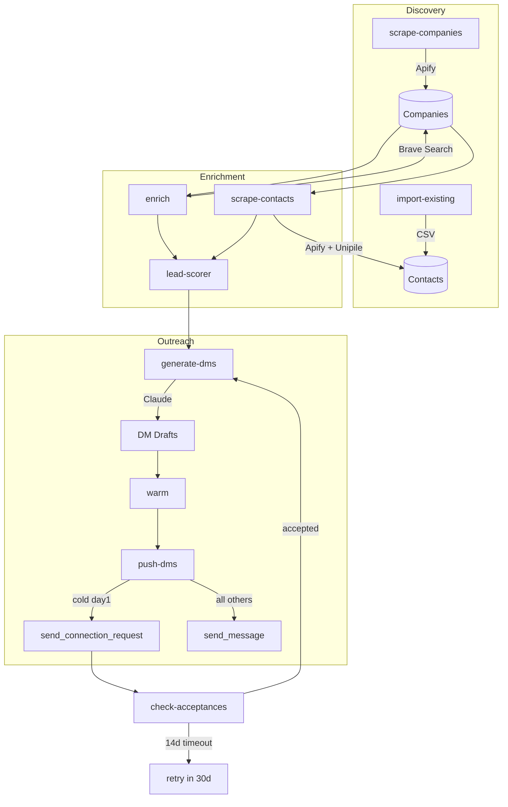
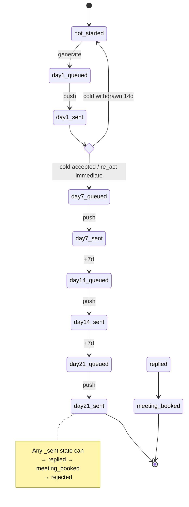

# Pipeline Flow

## Main Pipeline

```mermaid
flowchart TD
    subgraph Discovery
        scrape-companies -->|Apify| Companies[(Companies)]
        import-existing -->|CSV| Contacts[(Contacts)]
    end

    subgraph Enrichment
        Companies --> enrich -->|Brave Search| Companies
        Companies --> scrape-contacts -->|Apify + Unipile| Contacts
        enrich --> lead-scorer
        scrape-contacts --> lead-scorer
    end

    subgraph Outreach
        lead-scorer --> generate-dms -->|Claude| Drafts[DM Drafts]
        Drafts --> warm --> push-dms
        push-dms -->|cold day1| send_connection_request
        push-dms -->|all others| send_message
    end

    send_connection_request --> check-acceptances
    check-acceptances -->|accepted| generate-dms
    check-acceptances -->|14d timeout| withdrawn[retry in 30d]
```

## Contact Status Machine

```mermaid
stateDiagram-v2
    [*] --> not_started
    not_started --> day1_queued: generate
    day1_queued --> day1_sent: push

    state fork <<choice>>
    day1_sent --> fork
    fork --> day7_queued: cold accepted / re_act immediate
    fork --> not_started: cold withdrawn 14d

    day7_queued --> day7_sent: push
    day7_sent --> day14_queued: +7d
    day14_queued --> day14_sent: push
    day14_sent --> day21_queued: +7d
    day21_queued --> day21_sent: push

    note right of day21_sent: Any _sent state can<br/>→ replied → meeting_booked<br/>→ rejected

    replied --> meeting_booked
    meeting_booked --> [*]
    day21_sent --> [*]
```
