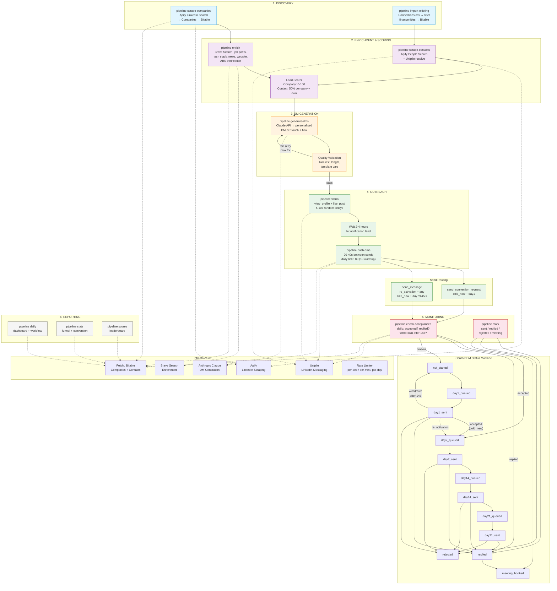

```mermaid
flowchart TD
    subgraph DISCOVERY["1. DISCOVERY"]
        SC["pipeline scrape-companies<br/>Apify LinkedIn Search<br/>→ Companies → Bitable"]
        IE["pipeline import-existing<br/>Connections.csv → filter<br/>finance titles → Bitable"]
    end

    subgraph ENRICHMENT["2. ENRICHMENT & SCORING"]
        EN["pipeline enrich<br/>Brave Search: job posts,<br/>tech stack, news, website,<br/>ABN verification"]
        SCT["pipeline scrape-contacts<br/>Apify People Search<br/>+ Unipile resolve"]
        LS["Lead Scorer<br/>Company: 0-100<br/>Contact: 50% company + own"]
    end

    subgraph DM_GEN["3. DM GENERATION"]
        GD["pipeline generate-dms<br/>Claude API → personalised<br/>DM per touch + flow"]
        QV["Quality Validation<br/>blacklist, length,<br/>template vars"]
    end

    subgraph OUTREACH["4. OUTREACH"]
        WM["pipeline warm<br/>view_profile + like_post<br/>5-10s random delays"]
        WAIT["Wait 2-4 hours<br/>let notification land"]
        PD["pipeline push-dms<br/>20-40s between sends<br/>daily limit: 80 (10 warmup)"]
    end

    subgraph SEND_LOGIC["Send Routing"]
        CR["send_connection_request<br/>cold_new + day1"]
        SM["send_message<br/>re_activation + any<br/>cold_new + day7/14/21"]
    end

    subgraph MONITORING["5. MONITORING"]
        CA["pipeline check-acceptances<br/>daily: accepted? replied?<br/>withdrawn after 14d?"]
        MK["pipeline mark<br/>sent / replied /<br/>rejected / meeting"]
    end

    subgraph REPORTING["6. REPORTING"]
        DL["pipeline daily<br/>dashboard + workflow"]
        ST["pipeline stats<br/>funnel + conversion"]
        SCO["pipeline scores<br/>leaderboard"]
    end

    subgraph STATUS_FLOW["Contact DM Status Machine"]
        direction LR
        NS["not_started"]
        D1Q["day1_queued"]
        D1S["day1_sent"]
        D7Q["day7_queued"]
        D7S["day7_sent"]
        D14Q["day14_queued"]
        D14S["day14_sent"]
        D21Q["day21_queued"]
        D21S["day21_sent"]
        REP["replied"]
        REJ["rejected"]
        MTG["meeting_booked"]

        NS --> D1Q --> D1S
        D1S -->|"accepted<br/>(cold_new)"| D7Q
        D1S -->|"re_activation"| D7Q
        D7Q --> D7S --> D14Q --> D14S --> D21Q --> D21S
        D1S --> REP
        D7S --> REP
        D14S --> REP
        D21S --> REP
        REP --> MTG
        D1S --> REJ
        D7S --> REJ
        D14S --> REJ
        D21S --> REJ
        D1S -->|"withdrawn<br/>after 14d"| NS
    end

    subgraph INFRA["Infrastructure"]
        BT["Feishu Bitable<br/>Companies + Contacts"]
        AP["Apify<br/>LinkedIn Scraping"]
        UP["Unipile<br/>LinkedIn Messaging"]
        CL["Anthropic Claude<br/>DM Generation"]
        BR["Brave Search<br/>Enrichment"]
        RL["Rate Limiter<br/>per-sec / per-min / per-day"]
    end

    %% Main flow connections
    SC --> EN
    IE --> SCT
    EN --> LS
    SCT --> LS
    LS --> GD
    GD --> QV
    QV -->|"pass"| WM
    QV -->|"fail: retry<br/>max 2x"| GD
    WM --> WAIT --> PD
    PD --> CR
    PD --> SM

    %% Post-send
    CR --> CA
    SM --> CA
    CA -->|"accepted"| D7Q
    CA -->|"replied"| REP
    CA -->|"timeout"| NS

    %% Manual marks
    MK --> REP
    MK --> REJ
    MK --> MTG

    %% Infrastructure connections
    SC -.-> AP
    SCT -.-> AP
    SCT -.-> UP
    EN -.-> BR
    GD -.-> CL
    WM -.-> UP
    PD -.-> UP
    CA -.-> UP
    SC -.-> BT
    EN -.-> BT
    PD -.-> BT
    CA -.-> BT

    %% Reporting reads
    DL -.-> BT
    ST -.-> BT
    SCO -.-> BT

    %% Styling
    classDef discovery fill:#e1f5fe,stroke:#0288d1
    classDef enrich fill:#f3e5f5,stroke:#7b1fa2
    classDef dm fill:#fff3e0,stroke:#f57c00
    classDef outreach fill:#e8f5e9,stroke:#388e3c
    classDef monitor fill:#fce4ec,stroke:#c62828
    classDef report fill:#f5f5f5,stroke:#616161
    classDef infra fill:#fafafa,stroke:#9e9e9e

    class SC,IE discovery
    class EN,SCT,LS enrich
    class GD,QV dm
    class WM,WAIT,PD,CR,SM outreach
    class CA,MK monitor
    class DL,ST,SCO report
```
