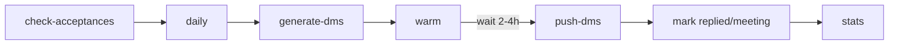
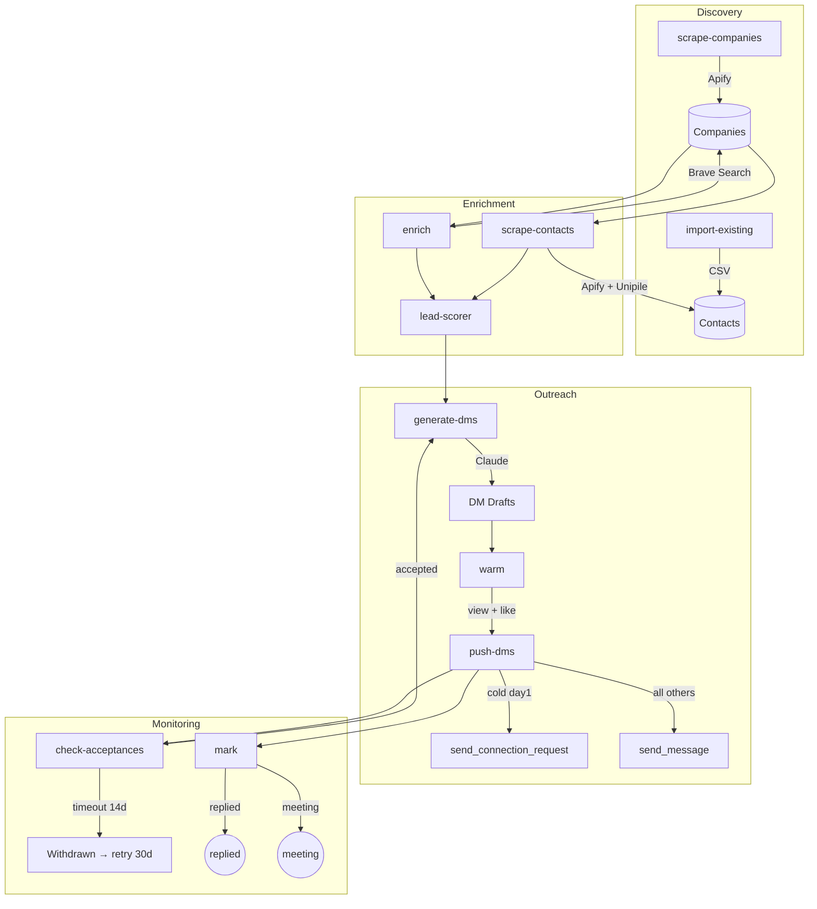
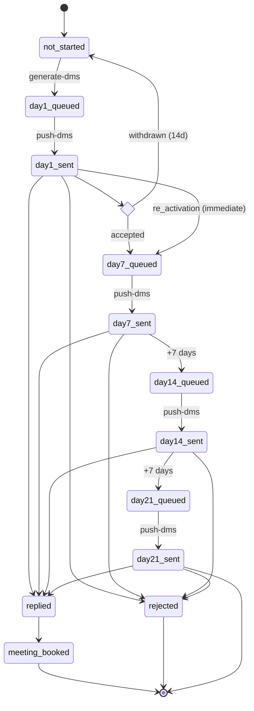

# Pipeline Flow

## Daily Workflow

```mermaid
flowchart LR
    A[check-acceptances] --> B[daily]
    B --> C[generate-dms]
    C --> D[warm]
    D -->|wait 2-4h| E[push-dms]
    E --> F[mark replied/meeting]
    F --> G[stats]
```

## Main Pipeline

```mermaid
flowchart TD
    subgraph Discovery
        scrape-companies -->|"Apify"| Companies[(Companies)]
        import-existing -->|"CSV"| Contacts[(Contacts)]
    end

    subgraph Enrichment
        Companies --> enrich -->|"Brave Search"| Companies
        Companies --> scrape-contacts -->|"Apify + Unipile"| Contacts
        enrich --> lead-scorer
        scrape-contacts --> lead-scorer
    end

    subgraph Outreach
        lead-scorer --> generate-dms -->|"Claude"| Drafts[DM Drafts]
        Drafts --> warm -->|"view + like"| push-dms
        push-dms -->|"cold day1"| send_connection_request
        push-dms -->|"all others"| send_message
    end

    subgraph Monitoring
        push-dms --> check-acceptances
        check-acceptances -->|accepted| generate-dms
        check-acceptances -->|timeout 14d| withdrawn[Withdrawn → retry 30d]
        push-dms --> mark
        mark -->|replied| replied((replied))
        mark -->|meeting| meeting((meeting))
    end
```

## Contact Status Machine

```mermaid
stateDiagram-v2
    [*] --> not_started
    not_started --> day1_queued: generate-dms
    day1_queued --> day1_sent: push-dms

    state cold_new_fork <<choice>>
    day1_sent --> cold_new_fork
    cold_new_fork --> day7_queued: accepted
    cold_new_fork --> not_started: withdrawn (14d)

    day1_sent --> day7_queued: re_activation (immediate)

    day7_queued --> day7_sent: push-dms
    day7_sent --> day14_queued: +7 days
    day14_queued --> day14_sent: push-dms
    day14_sent --> day21_queued: +7 days
    day21_queued --> day21_sent: push-dms

    day1_sent --> replied
    day7_sent --> replied
    day14_sent --> replied
    day21_sent --> replied

    day1_sent --> rejected
    day7_sent --> rejected
    day14_sent --> rejected
    day21_sent --> rejected

    replied --> meeting_booked
    meeting_booked --> [*]
    rejected --> [*]
    day21_sent --> [*]
```
